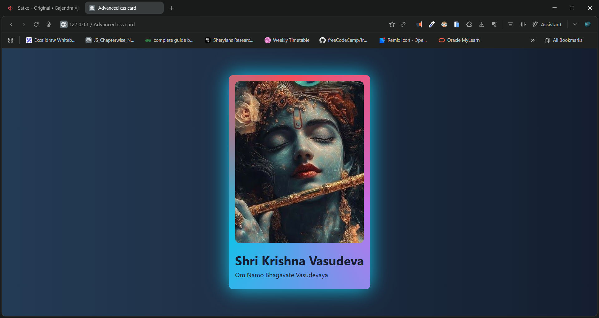

# 🌟 Advanced CSS Animated Card

A beautifully designed, fully responsive **CSS animated card** featuring smooth hover effects, conic-gradient animation, image zoom, and elegant typography.

## 📸 Preview



---

## 🎥 Demo Video

🎬 **Watch Demo:** [click to watch](https://youtu.be/fOOSP4WWEf0)

---

## 🔗 Live Demo

🚀 **Live Link:** []()

---

## 📁 Project Structure

```
project-folder/
│── index.html
│── style.css
│── image.jpg
└── README.md
```

---

## 🖥️ Features

### ✅ Smooth Animation

* Conic-gradient border animation using CSS `@property`
* Scale and text transition on hover
* Shadow glow effect for depth

### 🎨 Modern UI

* Fully responsive card
* Clean gradient background
* Minimalistic, elegant design
* Image zoom-in interaction

### ⚡ Pure CSS

* No JavaScript used
* Entire animation done through CSS keyframes and custom variables

---

## 🧩 Code Overview

### **HTML Structure**


You use a simple, clean layout with a main card containing an image, title, and subtitle.

### **CSS Styling**


The CSS includes:

* Gradient backgrounds
* `@property` for animatable CSS custom properties
* Conic gradient animation
* Hover transitions for image, text, and background

---

## 🚀 How to Run

1. Download or clone the repository
2. Place all files in the same folder
3. Open `index.html` in any browser

---

## 🛠️ Technologies Used

* **HTML5**
* **CSS3**
* Advanced CSS features:

  * `@property`
  * `conic-gradient()`
  * `keyframes`
  * Flexbox

---

## 🧑‍💻 Author

**Dileep**
Made with 💖 & JavaScript.
- 📧 [dileepkumawat525@gmail.com](mailto:dileepkumawat525@gmail.com)
- 🔗 [LinkedIn](https://www.linkedin.com/in/dileep-kumawat/)

---

## 📜 License

This project is open-source. You can modify and use it freely.